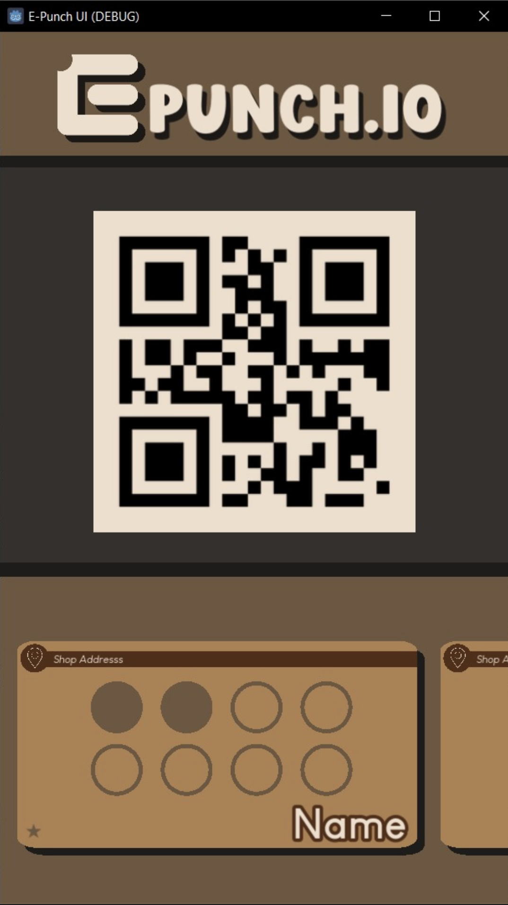

# E-PUNCH.io

A simple electronic punch card system.

Users have a personal QR code and digital punch cards for various businesses. Businesses scan the user's QR code to add punches. Accumulated punches lead to rewards.



## Features

* View and manage digital punch cards for multiple businesses
* Use without authentication (with a warning about potential data loss)
* Personal QR code for quick punch collection
* Track punch progress across different loyalty programs
* Automatic reward notifications when punch cards are complete

## Planning

See the detailed project planning document: [Planning Doc](https://docs.google.com/document/d/1aP9CDDbN2PSN6AypOyp7pGCODV2ZQdApm9iQcMuSTGI/edit?tab=t.0#heading=h.bmch098gxbif)

## User Journey

### Visiting "Pottery Cafe"

1.  I walk into "Pottery Cafe" and scan their QR code (or open `epunch.io` manually).
2.  I see my personal QR code on `epunch.io` and my list of punch cards.
    *   If it's my first time at Pottery Cafe:
        *   If I scanned their QR code: I might see a new "Pottery Punch Card" with 0/10 punches right away.
        *   If I opened `epunch.io` manually: The "Pottery Punch Card" will appear in my list only *after* the manager scans my QR code for the first time (usually showing 1/10 punches).
    *   If I've been here before, I see my existing "Pottery Punch Card" with its current punch count (e.g., n/10).
3.  I buy a coffee and show my QR code to the manager.
4.  The manager scans my QR code.
5.  I see my "Pottery Punch Card" on `epunch.io` update with +1 punch.
6.  When my card shows 10/10 punches ("Reward Ready!"):
    *   I tell the manager I want my free coffee and show my QR code.
    *   The manager scans it.
    *   I get my free coffee.
    *   I see my "Pottery Punch Card" reset to 0/10 punches on `epunch.io`.
    *   I see a note like "1 free coffee redeemed" for Pottery Cafe.

### Visiting a Different Cafe ("Cafe B")

1.  I visit "Cafe B" and scan their QR code (or open `epunch.io`).
2.  After buying something and the manager scans my QR code for the first time:
    *   I see a new "Cafe B Punch Card" appear in my list on `epunch.io`, starting with 1 punch (or 0).

## Core Entities

1.  **User:** The customer.
2.  **Merchant:** The business offering loyalty programs.
3.  **Loyalty Program:** Defines the rules and reward for a specific merchant offer (e.g., "10 punches for a free coffee").
4.  **Punch Card:** Tracks a specific user's progress in a loyalty program.
5.  **Punch:** A single punch event.

## Technical Implementation

### Tech Stack
* **Frontend:** React, TypeScript, Vite, Redux (for state management)
* **Backend:** NestJS (Node.js framework), TypeScript, TypeORM, Joi (for config validation)
* **Database:** PostgreSQL
* **Package Manager:** Yarn (all shared dev dependencies, e.g., typescript, are kept in the root package.json for the workspace)

### Infrastructure & Deployment
* **Frontend Hosting:** Vercel
* **Backend Hosting:** Fly.io (Dockerized NestJS app)
* **Database Hosting:** AWS RDS for PostgreSQL
* **Authentication (Future):** AWS Cognito
* **AWS Infrastructure Management:** Terraform (`infra/terraform`)
* **Configuration:** All config (including API endpoints, host, port) is centralized and managed via environment variables and `.env` files
* **Secrets:** Store all secrets in `.env`

### Project Structure

The application code resides within the `application/` directory and is structured as a multi-module TypeScript project:

```
application/
├── backend/     # NestJS backend code
├── frontend/    # React frontend code
└── common/      # Shared code (DTOs, constants, types, etc.)
```
* `common/` contains code shared between frontend and backend.
* Both `backend/` and `frontend/` import modules from `common/`.

#### Frontend Directory Structure (`application/frontend/src/`)

```
src/
├── api/                  # API client and related configurations
│   └── apiClient.ts      # Single file for all backend API calls
├── App.tsx               # Main application component, routing setup
├── main.tsx              # Entry point, renders App, Redux Provider
│
├── assets/               # Static assets (images, fonts, etc.)
│   └── images/
│   └── fonts/
│
├── components/           # Reusable UI components
│   ├── common/           # Very general components (Button, Input, Modal, Icon etc.)
│   └── layout/           # Layout components (Header, Footer, PageWrapper etc.)
│
├── features/             # Feature-specific components, hooks, and Redux slices
│   ├── auth/             # Example: Authentication feature
│   │   ├── LoginPage.tsx
│   │   └── authSlice.ts
│   └── punchCards/       # Example: Punch card management feature
│       ├── PunchCardListPage.tsx
│       └── punchCardSlice.ts
│
├── hooks/                # Custom React hooks (reusable across features)
│
├── pages/                # Top-level page components (if not directly in features/)
│   ├── HomePage.tsx
│   └── NotFoundPage.tsx
│
├── store/                # Redux store setup
│   ├── rootReducer.ts
│   └── store.ts
│
├── styles/               # Global styles, theme configuration
│   └── global.css
│
└── utils/                # General utility functions (not React-specific)
```

**Key Principles for Frontend Structure:**
*   **Features First:** Code is primarily organized by user-facing features to promote modularity and co-location of related logic (UI, state, specific hooks).
*   **Common Components:** Truly generic and reusable UI elements reside in `components/common/`.
*   **Minimalism:** Start with essential folders and expand as needed. Avoid premature abstraction.

#### Backend Directory Structure (`application/backend/src/`)

```
src/
├── config/               # Configuration setup and validation
│   └── config.ts        # Environment variables and app config
│
├── core/                # Core application code
│   ├── interceptors/    # Global interceptors
│   ├── filters/         # Global exception filters
│   └── types/          # Common types and interfaces
│
├── features/           # Feature modules
│   ├── auth/          # Authentication feature
│   │   ├── auth.module.ts
│   │   ├── auth.controller.ts
│   │   └── auth.service.ts
│   └── punch-cards/   # Punch card management feature
│       ├── punch-cards.module.ts
│       ├── punch-cards.controller.ts
│       ├── punch-cards.service.ts
│       └── entities/
│
├── database/          # Database configuration and entities
│   ├── entities/     # TypeORM entities
│   └── migrations/   # SQL DDL files
│
├── utils/            # Utility functions and helpers
│
└── main.ts          # Application entry point
```

**Key Principles for Backend Structure:**
* **Features First:** Code organized by domain features, each as a NestJS module
* **Clean Core:** Global interceptors, filters, and types in core/
* **Flat Entity Structure:** Database entities kept in a single location
* **Minimal Abstractions:** Direct service-to-controller communication, no facades or repositories

### Database Schema Management
* The database schema (table definitions, relationships) is managed using raw SQL DDL.
* No migration scripts: manage schema manually and keep one initial SQL DDL in sync.

### Implementation Guidelines

**General**
- Minimalistic: implement only what is necessary.
- Avoid leaving comments.
- Always use types, avoid `any`.
- The website is developed with a mobile-first approach.

**Frontend**
- All backend calls are in a single `apiClient` file.
- All API calls use the `/api/v1` prefix, configured globally.

**Backend**
- No DTO validation.
- All API responses are wrapped in an `ApiResponse<T>` class.
- Use an `ApiResponseInterceptor` to wrap responses and handle `NotFoundException` as 200 OK with `null` data.
- Use a `GlobalHttpExceptionFilter` to handle and log all exceptions, returning a consistent error response shape.
- Consistent error handling.
